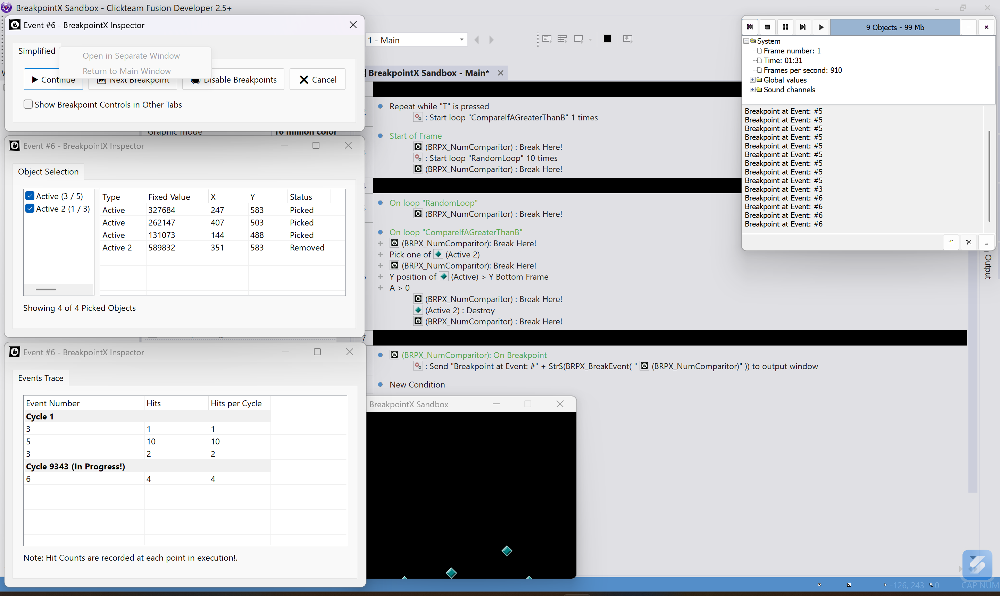
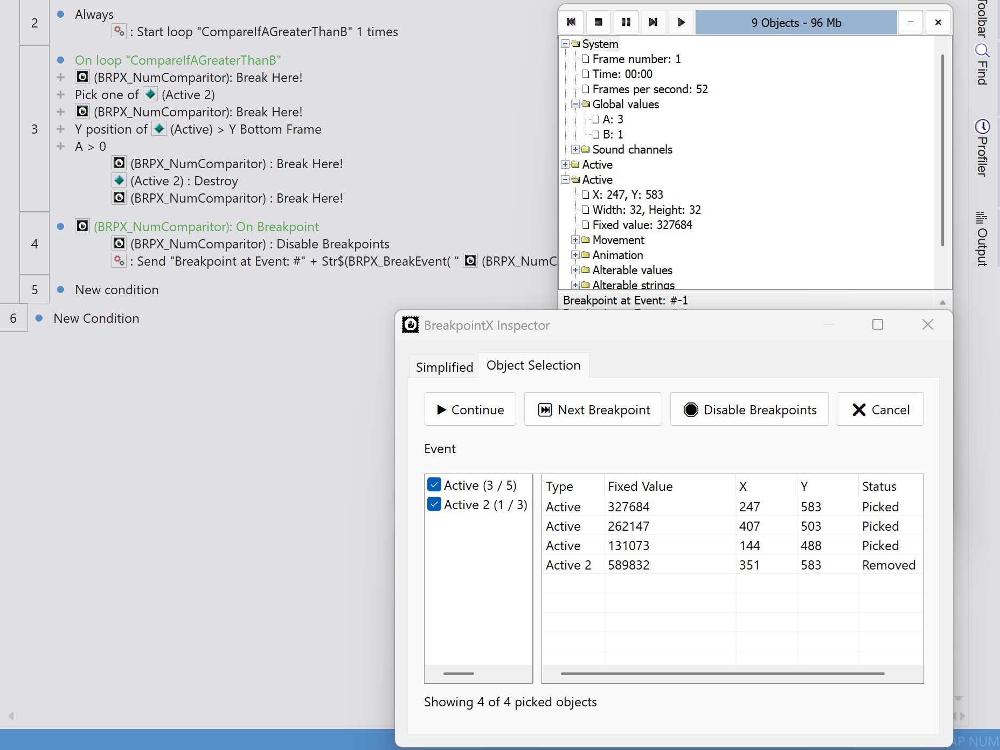
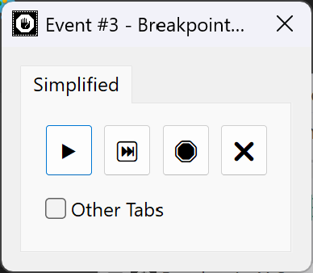
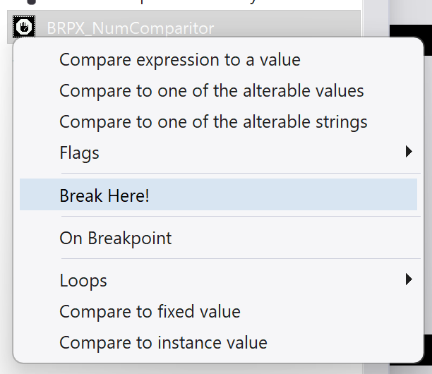
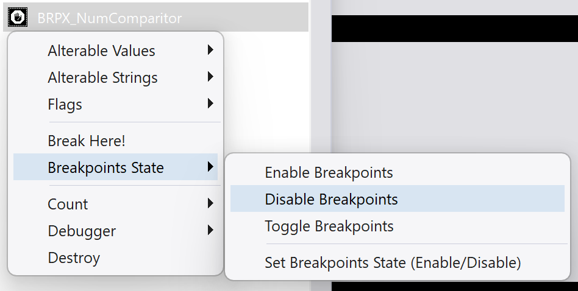
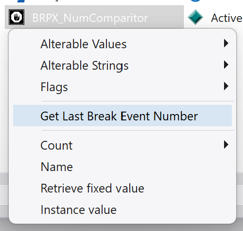

# BreakpointX

**\* For installation, check [Releases](https://github.com/LinkyMH/BreakpointX/releases)**

BreakpointX adds breakpoints to your Fusion Events. Pause at a Break Here call, inspect the current Object Selection, and follow which Events ran in the Events Trace!


---

## Features

- **Break in Actions & Conditions:** Put Break Here where you want to pause. For a Conditional breakpoint, add your usual Fusion Conditions before it. You already have an Event editor, so use it!
- **Inspect the Current Object Selection:** See which object types and instances are selected when the breakpoint is hit, along with their FixedValues and positions.
- **Breakpoint Callbacks:** Use On Breakpoint to run your own Events when a breakpoint pauses execution.
- **Event Line Numbers:** See the triggering Event number in the Inspector title and get the last recorded Event number through an Expression. If the number can't be read, the Inspector shows Unavailable.
- **Events Trace:** Follow recorded breaks in execution order, grouped by Fusion cycle. See each Event's total hits for the current frame and its hits in that cycle. Handy for Fastloops and other Events that run more than once per cycle. Consecutive hits on the same Event share a row.
- **Separate Inspector Windows:** Open tabs in their own windows to see Object Selection and Events Trace together, then return them to the main window whenever you want.
- **Optional Breakpoint Controls:** A checkbox in Simplified lets you show Continue, Next Breakpoint, Disable, and Cancel in the other tabs too. Leave it off to give the tables more room. You can also use keyboard shortcuts like F5 and F6!
- **Remembered Layout:** Tab sizes, window positions, selected tabs, detached windows, the splitter, column widths, and the controls checkbox are kept between closes and saved for your next run.

---

## Saved Layout

BreakpointX saves its Inspector preferences here:

```text
Computer\HKEY_CURRENT_USER\Software\Clickteam\Extensions\BreakpointX
```

Missing keys are created automatically. BreakpointX introduces the `Extensions\BreakpointX` location for its settings. Other extensions are welcome to use their own keys under `Extensions` too.

Please note that ONLY the UI preferences are saved. For example, breakpoint settings and trace history start fresh with each new session. Also, the trace keeps the latest 10k recorded Events, while hit totals keep counting even after older rows are removed.

---

## Notes

- Open "Examples\BreakpointX_Sandbox.mfa" to try the extension in Fusion.
- Comes with an MIT license. Free for commercial use! More info in "LICENSE.txt".
- Windows-only. Breakpoints work when running through the Fusion editor. Built applications skip breakpoint handling.
- Made on the original, official SDK. By Linky.

---

## Development

- Based on the Original, Official Fusion 2.5 SDK
- BreakpointX instances in the same running frame share their breakpoint settings, last Event number, and trace history. A separate runtime has its own state. A new runtime starts with breakpoints enabled and an empty trace. Saved Inspector layouts stay around.
- `BreakpointXAPIs\BreakpointAPI.cpp` calls the SDK and puts object selections back after callbacks. `BreakpointXAPIs\Inspector\Inspector.cpp` handles the Inspector windows and waits for the user to end the pause.
- Build Release Unicode, then run `Tests\RunInspectorTests.cmd` from an x86 Visual Studio developer prompt. The tests open Inspector windows and simulate Fusion callbacks. Try the changes in Fusion too.
- C++17

Contributions are welcome. If you're unsure where to start, open an Issue to discuss changes. If you are sure of a fix or feature, submit a pull request with the changes. But it would be much appreciated if you contact me on Discord first.

---

## Support

- Issues: https://github.com/LinkyMH/BreakpointX/issues
- Discussions/Questions: Open an Issue
- **(Most prefered):** Contact me on Discord (DM / Click Converse Discord Server): `linky.m`

When reporting a problem, please include:

- Runtime (Windows, Android, iOS, etc.)
- Goal or what's expected, and what happens instead
- A minimal reproduction (Events screenshot or MFA)

---

## Media Showcase

Screenshots:







  